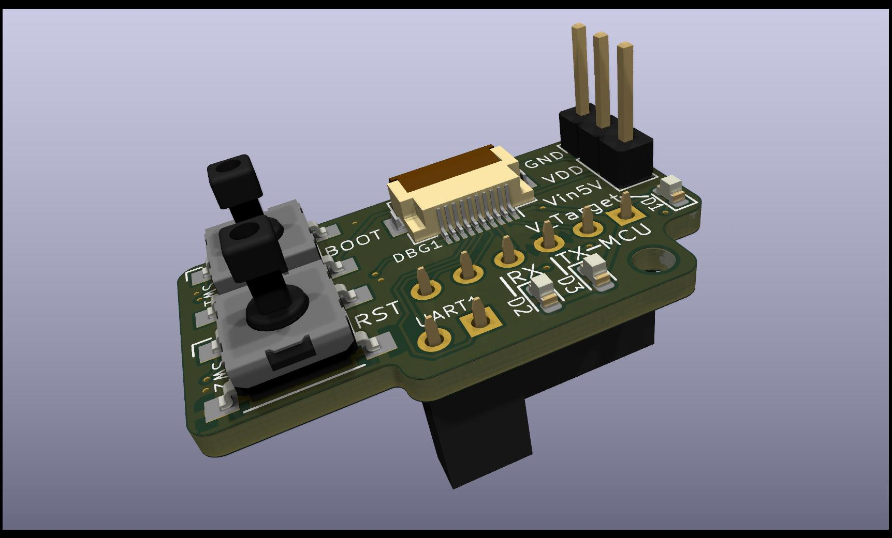
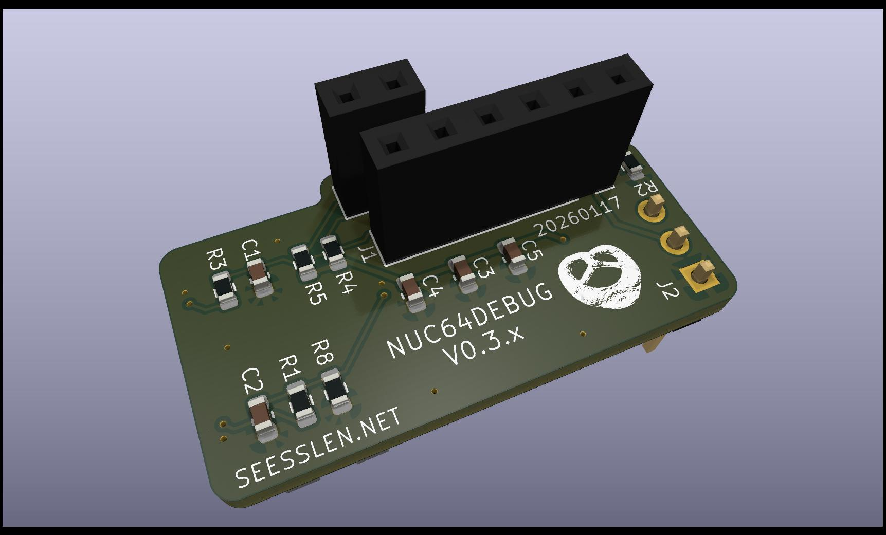

<h1 style="background:url(doc/background.jpg);">NUC64DEBUG</h1>

## Overview

|           |                                                               |
|:----------|:--------------------------------------------------------------|
| Name      | NUC64DEBUG                                                    |
| HW-Rev    | v0.3.x                                                        |
| Docu      | 20260117                                                      |
| Dimensions| 17.30mm x 30.43mm                                             |

Small adapter PCB to connect a STM32 based custom PCB via 10P-FPC with the STLink-part
of an Nucleo64-Board.

## PCB

| Top                                              |  Bottom                                       |
|:-------------------------------------------------|:----------------------------------------------|
|  |  |

 

## Connectors

### Debug

| Connector-pin |  Function              |
|:--------------|:-----------------------|
| 1             | VDD Target             |
| 2             | SWCLK                  |
| 3             | GND                    |
| 4             | SWDIO                  |
| 5             | NRST                   |
| 6             | NC (Reserved for SWO)  |
| 7             | UART TX (Target)       |
| 8             | UART RX (Target)       |
| 9             | VIN 5V                 |
| 10            | BOOT0                  |

## J1

| Connector-pin |  Function              |
|:--------------|:-----------------------|
| 1             | VDD                    |
| 2             | SWCLK                  |
| 3             | GND                    |
| 4             | SWDIO                  |
| 5             | NRST                   |
| 6             | SWO                    |

## UART1

| Connector-pin |  Function                                      |
|:--------------|:-----------------------------------------------|
| 1             | TX (ST-Link / Host) -> yellow on adapter cable |
| 2             | RX (ST-Link / Host) -> red on adapter cable    |

## Errata

* If you have problems with the  UART you may need to update firmware of STLink.
Version V2J20M4 did not work, after update to V2J38M27 problems disappeared.

* V0.2.x: Boot-Button not functional. Connect J2-Pin2(VDD) to button pad in the corner.

 campo@seesslen.net 

